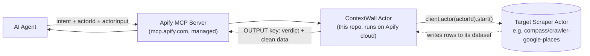
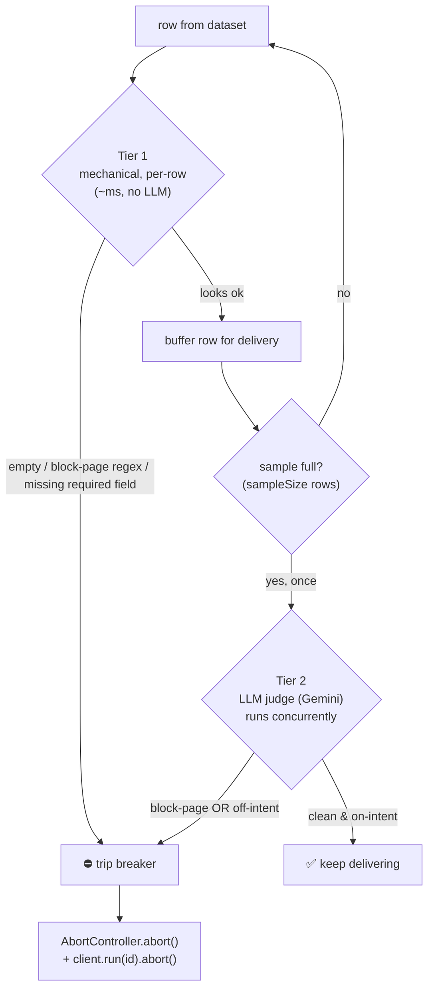
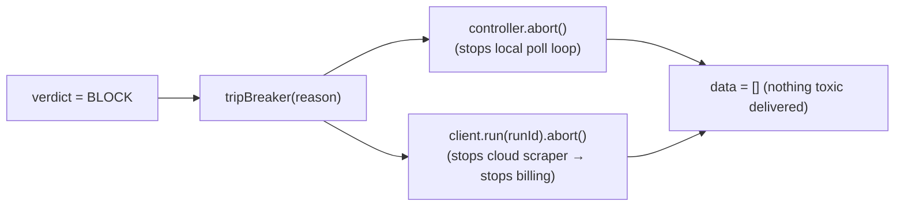

# ContextWall Firewall — How It Works Under the Hood

A data firewall packaged as an **Apify actor**. The agent calls *this* actor
instead of the scraper directly. It starts the scraper, watches its output as it
arrives, and **aborts the upstream run the moment toxic data appears** — before
anything reaches the agent's context window.

---

## 1. Where it sits

The agent never talks to the scraper. It talks to the firewall, via Apify's own
managed MCP server (zero custom MCP code on our side).



Key point: the firewall calls the target scraper with **its own** Apify token
(`Actor.getEnv().token`) — the agent needs no extra secrets to reach the scraper.

---

## 2. The two-tier funnel

Every row passes Tier 1; a small sample also goes through Tier 2. Either tier
can trip the breaker.



- **Tier 1 — mechanical** ([src/firewall/tier1.ts](src/firewall/tier1.ts)).
  Runs on *every* row as it arrives: empty check, a regex blocklist
  (`cloudflare`, `captcha`, `just a moment`, `403 forbidden`…), and a
  required-field shape check. Catches hard block pages on the **first poisoned
  row** — even when the JSON shape is perfect.
- **Tier 2 — semantic** ([src/firewall/tier2.ts](src/firewall/tier2.ts)).
  Fires **once**, on the first `sampleSize` rows, *while polling continues*. A
  cheap fast model (Gemini Flash-Lite, [src/llm.ts](src/llm.ts)) decides
  `isBlockPage?` and `aligned?` with the intent. Catches the "real but wrong"
  case (e.g. sushi places when you asked for Georgian).
- **Fail closed.** No `GEMINI_API_KEY`, or any LLM error → drops to a keyword
  heuristic (negation + vocab overlap). It **never waves data through on error**.

---

## 3. Polling, not streaming

Apify actors can't stream their output. So the firewall **polls the live
dataset** at a fixed interval (default 750ms) while the upstream run is
`RUNNING`, reading only the new rows each pass. Same abort behaviour as a true
stream — just sampled. (Loop: [src/firewall/run.ts](src/firewall/run.ts).)

```mermaid
sequenceDiagram
  participant Ag as AI Agent
  participant CW as ContextWall (runFirewall)
  participant Sc as Target Scraper

  Ag->>CW: intent, actorId, actorInput
  CW->>Sc: actor(actorId).start(actorInput)
  Sc-->>CW: { runId, datasetId }

  loop poll until run finished or aborted
    CW->>Sc: dataset(datasetId).listItems(offset)
    Sc-->>CW: new rows
    loop each new row
      CW->>CW: Tier 1 (~ms)
      alt block-page / bad shape
        CW->>Sc: run(runId).abort() (stop billing)
        Note over CW: verdict = BLOCK (tier1), break
      else ok
        CW->>CW: buffer row; once sample full → launch Tier 2 (async)
      end
    end
    CW->>Sc: run(runId).get() (status?)
    alt still RUNNING
      CW->>CW: sleep(750ms)
    end
  end

  CW->>CW: await Tier 2 result
  alt Tier 2 said BLOCK
    CW->>Sc: run(runId).abort()
    CW-->>Ag: ⛔ { ok:false, tier:"tier2", reason, data:[] }
  else clean
    CW-->>Ag: ✅ { ok:true, data:[...clean rows] }
  end
```

The Tier 2 judge is launched but **not awaited inside the loop** — polling keeps
going while Gemini thinks. If the judge comes back BLOCK before the run finishes,
it trips the same breaker mid-stream.

---

## 4. The circuit breaker

One latch, two effects. First block from either tier calls `tripBreaker()` once:



- `controller.abort()` breaks the local poll loop immediately.
- `client.run(runId).abort()` kills the cloud scraper so it stops running and
  billing before it finishes.
- On any block, delivered `data` is reset to `[]` — the agent gets the verdict +
  reason, never the poisoned rows.

Result on the "hard" (Cloudflare) fixture: aborted after **~1 of 12 rows**, 0
toxic rows delivered, ~92% of the job never runs.

---

## 5. What the agent gets back

Written to the actor's `OUTPUT` key inline (not a dataset pointer — we abort
early, so the payload stays small and arrives in a single MCP tool response):

```json
{
  "ok": false,
  "tier": "tier1",
  "reason": "blocklist_keyword",
  "detail": "Item #0 contains block-page signal: \"Cloudflare\".",
  "confidence": null,
  "stats": { "itemsStreamed": 1, "itemsDelivered": 0, "aborted": true, "upstreamRunId": "..." },
  "data": []
}
```

| Field | Meaning |
|-------|---------|
| `ok` | passed both tiers? |
| `tier` | which tier blocked (`tier1` / `tier2` / `null` if clean) |
| `reason` | machine code: `clean`, `blocklist_keyword`, `schema_invalid`, `empty`, `semantic_mismatch`, `semantic_block` |
| `detail` | human-readable explanation |
| `stats.itemsStreamed` | rows seen before stopping |
| `stats.itemsDelivered` | clean rows returned (0 on any block) |
| `stats.aborted` | did the breaker trip? |
| `data` | clean rows, or `[]` if blocked |

---

## 6. One-line mental model

> A bouncer for the agent's context window: it starts the scraper, checks each
> row at the door (fast mechanical, then a smart sample check), and the instant
> it sees trash it cuts the scraper off and hands the agent a rejection slip
> instead of the garbage.

See [DEMO.md](DEMO.md) to run all of this.
